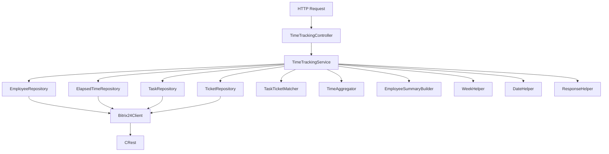

# TASK-069: Этап 1 — Анализ и подготовка структуры

**Дата создания:** 2025-12-23 18:18 (UTC+3, Брест)  
**Версия:** 1.0  
**Статус:** Планирование  
**Исполнители:** Рефактор-менеджер, Технический писатель

---

## 📋 Цель этапа

Провести детальный анализ текущего кода `api/tickets-time-tracking-sector-1c.php`, выделить функциональные блоки, определить зависимости и спроектировать целевую архитектуру модуля.

---

## 🔍 Задачи этапа

### 1. Анализ текущего кода

#### 1.1. Инвентаризация функций

Проанализировать все функции в файле и классифицировать их по назначению:

**Функции работы с датами и неделями:**
- `getWeekBounds()` — границы текущей ISO-недели
- `getFourWeeksBounds()` — границы 4 недель
- `getWeekNumberByDate()` — определение номера недели по дате
- `isInRange()` — проверка попадания даты в интервал

**Функции работы с HTTP:**
- `jsonResponse()` — формирование JSON-ответа
- `parseJsonBody()` — парсинг тела запроса

**Функции работы с Bitrix24 API:**
- `getSector1CEmployees()` — получение сотрудников сектора 1С
- `getElapsedTimeRecords()` — получение записей трудозатрат
- `getTasksByIds()` — получение задач по ID
- `getEmployeesData()` — получение данных сотрудников
- `getTasksDetails()` — получение детальной информации о задачах

**Функции доменной логики:**
- `matchTasksWithTickets()` — матчинг задач с тикетами
- `aggregateByWeeksAndEmployees()` — агрегация по неделям и сотрудникам
- `createEmployeesSummary()` — построение summary по сотрудникам

**Основная логика:**
- Блок `try-catch` в конце файла — оркестрация всего процесса

#### 1.2. Анализ зависимостей

Определить зависимости между функциями:

```
Основная логика
├── parseJsonBody()
├── getWeekBounds()
├── getFourWeeksBounds()
├── getSector1CEmployees()
│   └── CRest::call('user.get')
├── getElapsedTimeRecords()
│   ├── CRest::call('tasks.task.list')
│   └── CRest::call('task.elapseditem.getlist')
├── getTasksByIds()
│   └── CRest::callBatch('tasks.task.get')
├── matchTasksWithTickets()
│   ├── CRest::call('crm.item.list')
│   └── getWeekNumberByDate()
├── getEmployeesData()
│   └── CRest::call('user.get')
├── aggregateByWeeksAndEmployees()
│   ├── getWeekNumberByDate()
│   └── matchTasksWithTickets() (через taskTicketMap)
├── createEmployeesSummary()
└── getTasksDetails() (опционально)
    ├── CRest::callBatch('tasks.task.get')
    └── matchTasksWithTickets()
```

#### 1.3. Анализ констант и конфигурации

Выделить все константы и параметры:

```php
// Константы
const SECTOR_1C_DEPARTMENT_ID = 366;
const ENTITY_TYPE_ID = 140;
const SECTOR_1C_TAG = '1C';

// Параметры пагинации
$pageSize = 50;
$batchSize = 50;
$perPage = 10 (по умолчанию для задач)
```

#### 1.4. Анализ структуры данных

Определить структуры данных, используемые в модуле:

**Запись трудозатраты:**
```php
[
    'ID' => int,
    'TASK_ID' => int,
    'USER_ID' => int,
    'CREATED_DATE' => string,
    'SECONDS' => int,
    'MINUTES' => float,
    'HOURS' => float,
    'COMMENT_TEXT' => string,
    '_task' => array,
    '_ufCrmTask' => array|null
]
```

**Неделя:**
```php
[
    'weekNumber' => int,
    'weekStartUtc' => string,
    'weekEndUtc' => string,
    'weekStart' => DateTimeImmutable,
    'weekEnd' => DateTimeImmutable
]
```

**Ответ API:**
```php
[
    'success' => bool,
    'meta' => [
        'weekNumber' => int,
        'weekStartUtc' => string,
        'weekEndUtc' => string,
        'totalWeeks' => int,
        'sector1CEmployeesCount' => int
    ],
    'data' => [
        'totalElapsedTime' => float,
        'totalElapsedTimeUnit' => 'hours',
        'totalRecordsCount' => int,
        'weeks' => array,
        'employeesSummary' => array,
        'tasks' => array (опционально),
        'pagination' => array (опционально)
    ]
]
```

### 2. Проектирование целевой архитектуры

#### 2.1. Диаграмма слоёв

```
┌─────────────────────────────────────┐
│   Controller Layer                   │
│   TimeTrackingController             │
│   - Парсинг запроса                  │
│   - Валидация                        │
│   - Формирование ответа              │
└──────────────┬──────────────────────┘
               │
┌──────────────▼──────────────────────┐
│   Service Layer                      │
│   TimeTrackingService                │
│   - Оркестрация бизнес-логики        │
│   - Управление потоком данных        │
└──────────────┬──────────────────────┘
               │
       ┌───────┴────────┐
       │                │
┌──────▼──────┐  ┌──────▼──────────────┐
│ Repository  │  │ Domain Layer         │
│ Layer       │  │ - TaskTicketMatcher  │
│             │  │ - TimeAggregator     │
│ - Employee  │  │ - EmployeeSummary    │
│ - Task      │  │   Builder            │
│ - Ticket   │  └─────────────────────┘
│ - Elapsed   │
│   Time      │
└──────┬──────┘
       │
┌──────▼──────────────────────────────┐
│   Bitrix Layer                       │
│   Bitrix24Client                     │
│   - Обёртка над CRest                │
│   - Обработка ошибок                 │
└──────────────────────────────────────┘
```

#### 2.2. Определение интерфейсов

**Интерфейс репозитория:**
```php
interface RepositoryInterface
{
    public function findByIds(array $ids): array;
    public function findByFilter(array $filter): array;
}
```

**Интерфейс агрегатора:**
```php
interface AggregatorInterface
{
    public function aggregate(array $records, array $weeks): array;
}
```

#### 2.3. Определение контрактов

**Контракт метода `getTimeTrackingData()`:**
```php
/**
 * @param array $params Параметры запроса:
 *   - product: string (обязательно, должен быть '1C')
 *   - weekStartUtc: string|null (опционально)
 *   - weekEndUtc: string|null (опционально)
 *   - includeTaskDetails: bool (опционально, по умолчанию false)
 *   - taskIds: array|null (опционально, для фильтрации задач)
 *   - page: int (опционально, по умолчанию 1)
 *   - perPage: int (опционально, по умолчанию 10)
 * @return array Структура ответа API
 */
```

### 3. Создание диаграммы архитектуры

Создать визуальную диаграмму (в формате Mermaid или текстовом формате):



### 4. Подготовка списка тестовых сценариев

#### 4.1. Unit-тесты

**WeekHelper:**
- Тест `getWeekBounds()` с переданными датами
- Тест `getWeekBounds()` без параметров (текущая неделя)
- Тест `getFourWeeksBounds()` — проверка 4 недель
- Тест `getWeekNumberByDate()` — определение номера недели
- Тест `isInRange()` — проверка попадания в интервал

**DateHelper:**
- Тест преобразования форматов дат
- Тест работы с UTC

**ResponseHelper:**
- Тест `jsonResponse()` — формирование JSON
- Тест `parseJsonBody()` — парсинг тела запроса

**Bitrix24Client:**
- Тест `getUsers()` — получение пользователей
- Тест `getTasks()` — получение задач
- Тест обработки ошибок API

**Repositories:**
- Тест `EmployeeRepository::getSector1CEmployees()`
- Тест `TaskRepository::getTasksByIds()`
- Тест `ElapsedTimeRepository::getElapsedTimeRecords()`

**Domain Services:**
- Тест `TaskTicketMatcher::matchTasksWithTickets()`
- Тест `TimeAggregator::aggregateByWeeksAndEmployees()`
- Тест `EmployeeSummaryBuilder::createEmployeesSummary()`

#### 4.2. Интеграционные тесты

- Тест полного цикла получения данных (без `includeTaskDetails`)
- Тест полного цикла с `includeTaskDetails=true`
- Тест обработки пустых данных
- Тест обработки ошибок Bitrix24 API
- Тест валидации параметров запроса

#### 4.3. Тесты производительности

- Измерение времени выполнения запроса
- Сравнение производительности старого и нового кода
- Тест работы с большим объёмом данных

---

## 📝 Результаты этапа

### Документы, которые должны быть созданы:

1. **Анализ текущего кода** (`DOCS/ANALYSIS/tickets-time-tracking-analysis.md`)
   - Инвентаризация всех функций
   - Диаграмма зависимостей
   - Структуры данных

2. **Диаграмма целевой архитектуры** (в документе или отдельно)
   - Слои архитектуры
   - Взаимодействие компонентов
   - Потоки данных

3. **Список интерфейсов и контрактов** (в документе анализа)
   - Интерфейсы репозиториев
   - Контракты методов
   - Структуры данных

4. **План тестирования** (`DOCS/TESTING/tickets-time-tracking-test-plan.md`)
   - Unit-тесты
   - Интеграционные тесты
   - Тесты производительности

---

## ✅ Критерии приёмки этапа

- [ ] Все функции в текущем файле проанализированы и классифицированы
- [ ] Диаграмма зависимостей между функциями создана
- [ ] Все константы и параметры конфигурации выделены
- [ ] Структуры данных задокументированы
- [ ] Целевая архитектура спроектирована и задокументирована
- [ ] Диаграмма архитектуры создана
- [ ] Интерфейсы и контракты определены
- [ ] План тестирования подготовлен
- [ ] Все документы созданы и проверены

---

## 🔗 Связанные документы

- **Основной план:** `DOCS/REFACTORING/TASK-069-refactoring-plan-tickets-time-tracking.md`
- **Исходный файл:** `api/tickets-time-tracking-sector-1c.php`
- **Следующий этап:** `DOCS/REFACTORING/TASK-069-stage-02-structure.md`

---

## ⏱️ Оценка времени

**2-3 часа**

- Анализ кода: 1 час
- Проектирование архитектуры: 30 минут
- Создание диаграмм: 30 минут
- Подготовка плана тестирования: 30 минут
- Документирование: 30 минут

---

**История правок:**
- 2025-12-23 18:18 (UTC+3, Брест): Создан документ этапа 1


